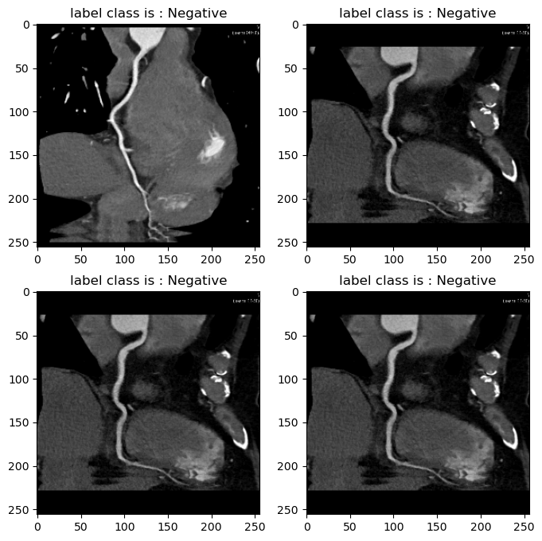

### Data Resource and Per-Processing 

the dats used in this project contain samples of Coronary alrtrey collect from 
The University Jordan Science and Technology 

## Data Description 

1. **General description:** 

Coronary arteries supply blood to the heart muscle. Like all other tissues in the body, the heart muscle needs oxygen-rich blood to function. Also, oxygen-depleted blood must be carried away. The coronary arteries wrap around the outside of the heart. Small branches dive into the heart muscle to bring blood

2. **Data Infos** 

the Dataset was collected by colleagues at the University of Jordan Science and Technology which contains Normal and Abnormal Medical images and before used an algorithm to trace the map of Vessel blood at the Lab

<div align="center">
    
</div>

**Licience** 

```
    @misc{youness el brag_2023,
        title={Coronary Artery Diseaes DataSet Normal || Abnormal},
        url={https://www.kaggle.com/dsv/5826841},
        DOI={10.34740/KAGGLE/DSV/5826841},

```

#### Prpcess Data

Process Dara runing following the Script which provide full implmentation to saev the samples in **.npy** which performe outout folder conatain all Data processed 

**Notation:** you will need to provide relative path directory **PATH** and **OUTPUT** #

```YAML
PATH  "./ProcessedFolder/
OUTPUT = "./coronary-artery-diseaes-dataset-normal-abnormal/Coronary_Artery/Dataset"
```


to run the script following command :

```python
     python Processe_data.py --PATH INSERT_PATH_DATA --OUTPUT INSERT_OUTPUT_FOLDER
```     


